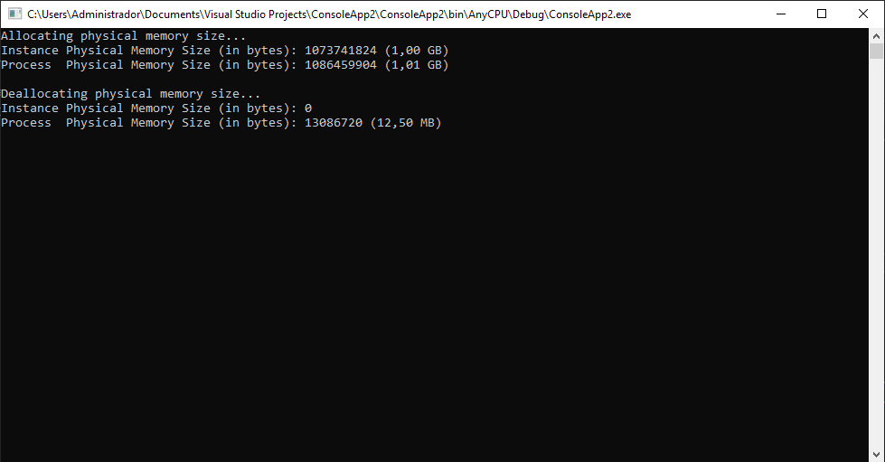

# HardwareStress

**HardwareStress** is a .NET library that provides a mechanism to stress hardware resources, such as CPU, Disk or RAM.

<u>**As any other software focused to stress hardware resources, you must use it at your own risk. I don't take any responsability of a hardware fail.**</u>

# **Donations**

##### Through Paypal:
If you like my work and want to support it, then please consider to deposit a donation through **Paypal** by clicking on the next button:

[](https://www.paypal.com/cgi-bin/webscr?cmd=_s-xclick&hosted_button_id=E4RQEV6YF5NZY)

[](https://www.paypal.com/cgi-bin/webscr?cmd=_s-xclick&hosted_button_id=E4RQEV6YF5NZY)

You are free to specify whatever amount of money you wish. That money will be sent to my **Paypal** account.

##### Through Envato:
If you are a .NET programmer, then maybe you would like to consider the purchase of 
'**DevCase for .NET Framework**', a powerful set of APIs for .NET developers, created by me. 

You can click the next button to go to the product specifications and the purchase page:

[](https://codecanyon.net/item/elektrokit-class-library-for-net/19260282)

Note that any source-code within the namespace 'DevCase' included in this **GitHub** repository, was freely extracted and distributed from the commercial library '**DevCase for .NET Framework**'.

<u>**Thanks in advance for your consideration!**</u> :thumbsup:


## Usage

Usage is very simple, there are 3 classes: **CpuStress**, **DiskStress** and **MemoryStress**, which provides an **Allocate()** method to start stressing resources, and a **Deallocate()** method to stop it.

## Usage Examples

##### CPU Stress

```vbnet
Using cpuStress As New CpuStress()
    Dim percentage As Single = 20.5F 20.50%

    Console.WriteLine("Allocating CPU usage percentage...")
    cpuStress.Allocate(percentage)
    Thread.Sleep(TimeSpan.FromSeconds(5))
    Console.WriteLine("Instance CPU average usage percentage: {0:F2}%", cpuStress.InstanceCpuPercentage)
    Console.WriteLine("Process  CPU average usage percentage: {0:F2}%", cpuStress.ProcessCpuPercentage)
    Console.WriteLine()

    Console.WriteLine("Deallocating CPU usage percentage...")
    cpuStress.Deallocate()
    Thread.Sleep(TimeSpan.FromSeconds(5))
    Console.WriteLine("Instance CPU average usage percentage: {0:F2}%", cpuStress.InstanceCpuPercentage)
    Console.WriteLine("Process  CPU average usage percentage: {0:F2}%", cpuStress.ProcessCpuPercentage)
End Using
```


##### Disk Stress

```vbnet
Using diskStress As New DiskStress()
    Console.WriteLine("Allocating disk I/O read and write operations...")
    diskStress.Allocate(fileSize:=1048576) 1 MB

    Thread.Sleep(TimeSpan.FromSeconds(10))

    Console.WriteLine("Stopping disk I/O read and write operations...")
    diskStress.Deallocate()

    Console.WriteLine()
    Console.WriteLine("Instance disk I/O read operations count: {0} (total of files read)", diskStress.InstanceReadCount)
    Console.WriteLine("Process  disk I/O read operations count: {0}", diskStress.ProcessReadCount)
    Console.WriteLine()
    Console.WriteLine("Instance disk I/O read data (in bytes): {0} ({1:F2} GB)", diskStress.InstanceReadBytes, (diskStress.InstanceReadBytes / 1024.0F ^ 3))
    Console.WriteLine("Process  disk I/O read data (in bytes): {0} ({1:F2} GB)", diskStress.ProcessReadBytes, (diskStress.ProcessReadBytes / 1024.0F ^ 3))
    Console.WriteLine()
    Console.WriteLine("Instance disk I/O write operations count: {0} (total of files written)", diskStress.InstanceWriteCount)
    Console.WriteLine("Process  disk I/O write operations count: {0}", diskStress.ProcessWriteCount)
    Console.WriteLine()
    Console.WriteLine("Instance disk I/O written data (in bytes): {0} ({1:F2} GB)", diskStress.InstanceWriteBytes, (diskStress.InstanceWriteBytes / 1024.0F ^ 3))
    Console.WriteLine("Process  disk I/O written data (in bytes): {0} ({1:F2} GB)", diskStress.ProcessWriteBytes, (diskStress.ProcessWriteBytes / 1024.0F ^ 3))
End Using
```


##### Memory Stress

```vbnet
Using memStress As New MemoryStress()
    Dim memorySize As Long = 1073741824 1 GB

    Console.WriteLine("Allocating physical memory size...")
    memStress.Allocate(memorySize)
    Console.WriteLine("Instance Physical Memory Size (in bytes): {0} ({1:F2} GB)", memStress.InstancePhysicalMemorySize, (memStress.InstancePhysicalMemorySize / 1024.0F ^ 3))
    Console.WriteLine("Process  Physical Memory Size (in bytes): {0} ({1:F2} GB)", memStress.ProcessPhysicalMemorySize, (memStress.ProcessPhysicalMemorySize / 1024.0F ^ 3))
    Console.WriteLine()
    Console.WriteLine("Deallocating physical memory size...")
    memStress.Deallocate()
    Console.WriteLine("Instance Physical Memory Size (in bytes): {0}", memStress.InstancePhysicalMemorySize)
    Console.WriteLine("Process  Physical Memory Size (in bytes): {0} ({1:F2} MB)", memStress.ProcessPhysicalMemorySize, (memStress.ProcessPhysicalMemorySize / 1024.0F ^ 2))
End Using
```


